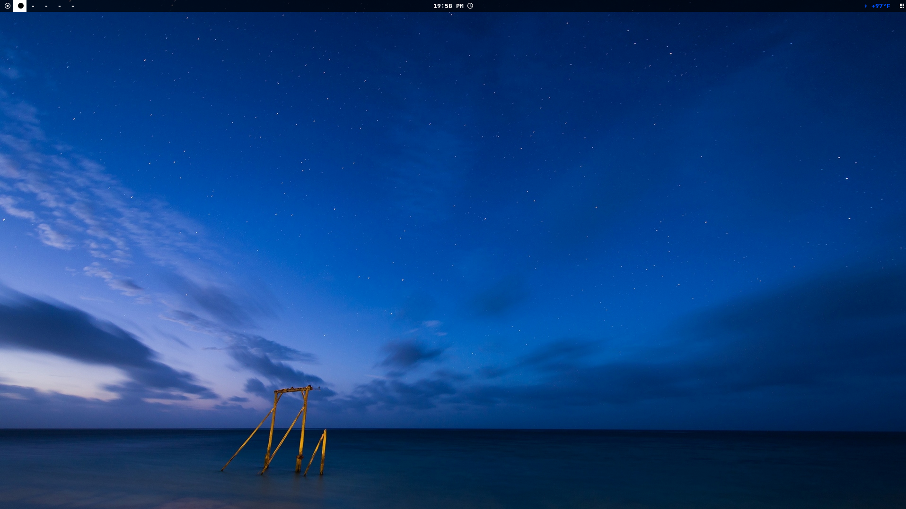

# My Arch Setup:
My arch setup for new computers. Includes my personal dotfile and scripts as well.
I nicked name this setup: "Kool"

This setup is supposed to be:
- Fast & Minimalist
- Cool

## Note:
This is only for people who've installed (Arch) Linux and want a basic setup.
However, this repo exists to serve me personally, but you clone it if you want.

## Usage:
Copy the Repo, and run the "install_setup.sh" script in "scripts", and finally copy over the "home" folder to your
home directory with: *sudo cp -rf ./home/. ~/*

## In this setup:
- Terminal: 		Kitty
- Shell:		Fish
- Notifier:		Mako
- App Launcher:		Rofi
- File Explorer:	Thunar
- Window Compsitor: 	Hyprland *+ Waybar,Hyprlock,Hypridle,Waypaper,Hyprpicker*
- Firewall:		Ufw
- Browser: 		WaterFox
- Communications: 	Vesktop, Hexchat
- Mail: 		BetterBird
- Passwords: 		KeePassXc
- Recording:		Obs
- Code Editor:		VsCodium, Zed
- Text Editor:		Neovim, Nano
- Video Player:		Mpv
- Notes:		Obsidian
- Video Editor:		OpenShot
- Office Suite:		LibreOffice (Fresh)
- Image Editor:		Gimp, Inkscape
